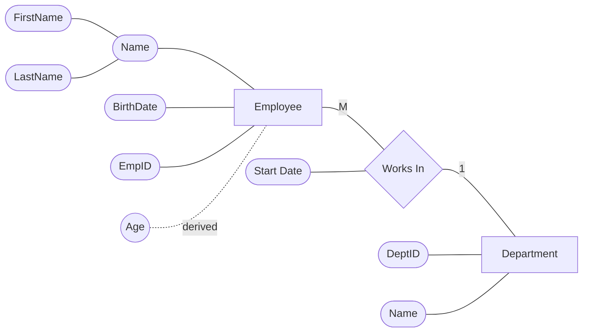

# Database Level 1 — One to Many → Relational Schema

**Note:** If we have a **one-to-many** or **many-to-one** relationship, we look at the side that has **"one"**, take the **key from that side**, and put it in the side that has **"many."**

---

## 1. ERD (Entity Relationship Diagram)



> `Employee ──M──── Works In ────1── Department`
> Read as: **many** Employees work in **one** Department.

---

## 2. Relational Schema

```text
             1 : M
┌──────────────────┐        ┌────────────────┐
│     Employee      │        │   Department   │
├────┬───────────────┤        ├────┬───────────┤
│ PK │ EmpID         │        │ PK │ DeptID    │
│    │ FirstName     │        │    │ Name      │
│    │ LastName      │        └────┴───────────┘
│    │ BirthDate     │                 ▲
│ FK │ DeptID        │─────────────────┘
│    │ StartDate     │
└────┴───────────────┘
```

**Rule applied:**

1. We create one table per entity, with its own attributes.
2. We take the **Primary Key from the "one" side** (Department.DeptID) and place it as a **Foreign Key on the "many" side** (Employee.DeptID).

---

## 3. The Two Tables (with sample data)

### Employees

| 🔑 EmpID | FirstName | LastName    | BirthDate | 🔗 DeptID (FK) | StartDate |
|:--------:|-----------|-------------|-----------|:--------------:|-----------|
| 1        | Mohammed  | Abu-Hadhoud | 6-11-1977 | 1               | 1/1/2010  |
| 2        | Ali       | Amjad       | 12-3-2000 | 1               | 2/2/2022  |
| 3        | Maha      | Omaran      | 11-6-2003 | 2               | 3/3/2021  |
| 4        | Fidaa     | Safwan      | 6-6-1991  | 4               | 4/4/2014  |

### Departments

| 🔑 DeptID | Name      |
|:---------:|-----------|
| 1         | IT        |
| 2         | Finance   |
| 3         | Marketing |
| 4         | Sales     |

**How to read them together:**

```text
Employee.DeptID  ──────►  Department.DeptID
     (FK)                      (PK)

Mohammed  → DeptID 1 → IT
Ali       → DeptID 1 → IT
Maha      → DeptID 2 → Finance
Fidaa     → DeptID 4 → Sales
```

One Department (e.g. **IT**, DeptID = 1) can have **many** employees (Mohammed **and** Ali).
Each Employee belongs to exactly **one** Department.

---

## 4. Question

**Why do we take the key from the ONE side and create a field for it on the MANY side?**

Because the **MANY side needs to know which ONE-side record it belongs to.** Both Mohammed and Ali belong to `DeptID = 1`, so instead of repeating the department's full information for every employee, we store that information **once** in the Department table and simply **reference it by ID** from the Employee table.

## 5. Answer

Doing it this way **reduces data redundancy.**

Instead of writing, for every employee row:

```text
Mohammed | IT
Ali      | IT
```

we write the much smaller:

```text
Mohammed | 1
Ali      | 1
```

and store `1 = IT` **exactly once**, inside the Department table.

---

## 6. ✅ Correct Way

```text
        ONE SIDE                              MANY SIDE

     ┌────────────────┐                ┌──────────────────────┐
     │    Department   │                │       Employee        │
     ├────┬─────────────┤                ├────┬───────────────────┤
     │ PK │ DeptID      │───────────────►│ FK │ DeptID           │
     │    │ Name        │                │ PK │ EmpID            │
     └────┴─────────────┘                │    │ FirstName        │
                                         │    │ LastName         │
                                         │    │ BirthDate        │
                                         │    │ StartDate        │
                                         └────┴───────────────────┘
```

```text
Department.DeptID (PK)
          │
          ▼
Employee.DeptID (FK)
```

The Primary Key from the **ONE** side (`Department.DeptID`) travels down and becomes a Foreign Key on the **MANY** side (`Employee.DeptID`). This is the only extra field the Employee table needs — everything else about the department (its name, location, etc.) stays put in the Department table.

---

## 7. ❌ Wrong Way — Putting the "Many" Data Inside the "One" Side's Table

What if, instead, we stuff all the department details directly into every Employee row?

| EmpID | FirstName | LastName    | DepartmentName | DepartmentLocation |
|:-----:|-----------|-------------|:---------------:|:-------------------:|
| 1     | Mohammed  | Abu-Hadhoud | 🔴 **IT**        | 🔴 **Vienna**        |
| 2     | Ali       | Amjad       | 🔴 **IT**        | 🔴 **Vienna**        |
| 3     | Sara      | Ahmed       | 🔴 **IT**        | 🔴 **Vienna**        |
| 4     | Adam      | Ali         | 🔴 **IT**        | 🔴 **Vienna**        |

🔴 = the **redundant** cells — the exact same two values, copy-pasted into every single row that belongs to the IT department.

```text
                          REDUNDANCY (repeated data)

Mohammed ────────► 🔴 IT ────────► 🔴 Vienna
Ali      ────────► 🔴 IT ────────► 🔴 Vienna
Sara     ────────► 🔴 IT ────────► 🔴 Vienna
Adam     ────────► 🔴 IT ────────► 🔴 Vienna
                     ▲                ▲
                     │                │
              same value        same value
              repeated 4x       repeated 4x
```

Every employee in IT drags around **two full copies** of department data that never changes per-employee. That's the redundancy: one fact ("IT is located in Vienna") is stored **four times** instead of once.

### Why this breaks

Say the IT department relocates:

```text
Vienna → Krems
```

With the wrong (flattened) design, someone has to remember to update **every single employee row** that mentions IT. If even one row gets missed:

| Employee | Department | Location    |
|----------|------------|-------------|
| Mohammed | IT         | Krems ✅    |
| Ali      | IT         | Krems ✅    |
| Sara     | IT         | Vienna ❌   |
| Adam     | IT         | Krems ✅    |

```text
IT = Krems
IT = Vienna

❌ Which one is correct? The database now contradicts itself.
```

This is called an **update anomaly** — a direct symptom of redundancy.

### Fixed with the correct (normalized) design

We change **one row, in one table**:

**Departments**

| DeptID | Name | Location   |
|:------:|------|------------|
| 1      | IT   | **Krems**  |
| 2      | Finance | Vienna  |
| 3      | Marketing | Vienna |
| 4      | Sales | Vienna    |

**Employees** (untouched — they only ever stored the ID)

| EmpID | FirstName | DeptID |
|:-----:|-----------|:------:|
| 1     | Mohammed  | 1      |
| 2     | Ali       | 1      |
| 3     | Sara      | 1      |
| 4     | Adam      | 1      |

```text
DeptID 1
   │
   ▼
IT
Krems
```

All four employees automatically point to the same, single, now-correct row. One update, zero contradictions.

---

## 8. Final Diagram

```text
                ONE                                MANY

         ┌────────────────┐               ┌────────────────────┐
         │   Department   │               │      Employee       │
         ├────────────────┤               ├────────────────────┤
         │ PK DeptID      │──────────────►│ FK DeptID          │
         │ Name           │               │ PK EmpID           │
         └────────────────┘               │ FirstName          │
                                          │ LastName           │
                                          │ BirthDate          │
                                          │ StartDate          │
                                          └────────────────────┘
```

## 9. Rule to Remember

> In a **1 : M relationship**, take the **Primary Key from the ONE side** and place it as a **Foreign Key in the MANY side**.

This avoids repeating the same descriptive data across many rows and eliminates redundancy — one fact, stored once, referenced everywhere it's needed.
