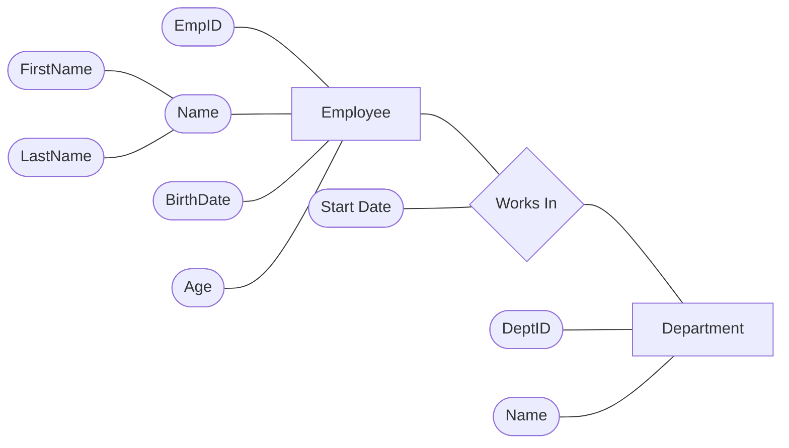
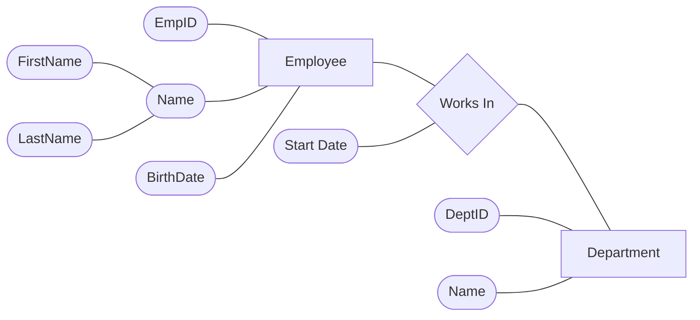

# DBMS

## 📌 Note

> If we have a **one-to-many** or **many-to-one** relationship, we look at the side that has **ONE**, take the **key** from the side that has "one", and put it in the side that has **MANY**.

---

# Example: ERD



**Cardinality:** `Department 1 ───────────< M Employee`

---

# Schema

```text
┌──────────────────────────────┐
│           Employee           │
├────┬─────────────────────────┤
│ PK │ EmpID                   │
│    │ FirstName               │
│    │ LastName                │
│    │ BirthDate               │
│ FK │ DeptID                  │
│    │ StartDate               │
└────┴──────────────┬──────────┘
                    │
                    │ M : 1
                    │
                    ▼
          ┌────────────────────┐
          │     Department     │
          ├────┬───────────────┤
          │ PK │ DeptID        │
          │    │ Name          │
          └────┴───────────────┘
```

> 💡 **Note:** Any attribute that comes from the **relationship** (like `StartDate`) will be placed in the **MANY** side.

---

# Tables

## Employees

| 🔑 EmpID | FirstName | LastName | BirthDate | DeptID 🔗 FK | StartDate |
|---:|---|---|---|---:|---|
| 1 | Mohammed | Abu-Hadhoud | 1/1/2000 | 1 | 2026 |
| 2 | Ali | Amjad | 2/2/2002 | 1 | 2027 |
| 3 | Maha | Omran | 3/3/2003 | 2 | 2028 |
| 4 | Fadi | Safwan | 4/4/2004 | 4 | 2029 |

## Departments

| 🔑 DeptID | Name |
|---:|---|
| 1 | IT |
| 2 | Finance |
| 3 | Marketing |
| 4 | Sales |

---

# ❓ Question

## Why do we take the key from the "ONE" side and create a field for the Department ID in the "MANY" side?

# ✅ Answer

Because with this way:

**① We reduce the redundancy.** That is, if we make a field of the "one" side in the "many" side — for example, if we have, in our case, two employees working in the **same department**, we would have to create a **row** for each one of them with the full department data repeated.

But when we put it in the **many side**, we just need to put the **number (ID) of the department only**.

```text
Mohammed → DeptID = 1
Ali      → DeptID = 1

DeptID = 1 → IT   (stored only ONCE in the Department table)
```

---

# Correct Way ✅

The **Primary Key from the ONE side** goes to the **MANY side** as a Foreign Key.

```text
ONE SIDE                         MANY SIDE

Department                      Employee
┌──────────────┐               ┌────────────────┐
│ PK DeptID    │──────────────►│ FK DeptID      │
│ Name         │               │ PK EmpID       │
└──────────────┘               │ FirstName      │
                               │ LastName       │
                               │ BirthDate      │
                               │ StartDate      │
                               └────────────────┘
```

This means:

```text
Department.DeptID (PK)
          │
          ▼
Employee.DeptID (FK)
```

---

# Wrong Way ❌

If we put all department information directly inside the Employee table:

| EmpID | FirstName | LastName | DepartmentName | DepartmentLocation |
|---:|---|---|---|---|
| 1 | Mohammed | Abu-Hadhoud | 🔴 IT | 🔴 Vienna |
| 2 | Ali | Amjad | 🔴 IT | 🔴 Vienna |
| 3 | Maha | Omran | 🔴 IT | 🔴 Vienna |
| 4 | Fadi | Safwan | 🔴 IT | 🔴 Vienna |

Now the same information is repeated:

```text
                    REDUNDANCY

Mohammed ─────► 🔴 IT ─────► 🔴 Vienna
Ali      ─────► 🔴 IT ─────► 🔴 Vienna
Maha     ─────► 🔴 IT ─────► 🔴 Vienna
Fadi     ─────► 🔴 IT ─────► 🔴 Vienna
                 ▲              ▲
                 │              │
             repeated        repeated
```

The repeated values (🔴 highlighted) are the **redundancy**.

---

# Why the Wrong Way Causes Problems

Imagine the IT department moves:

```text
Vienna → Krems
```

With the wrong design, we must update **every employee row**, and if we miss one:

| Employee | Department | Location |
|---|---|---|
| Mohammed | IT | Krems ✅ |
| Ali | IT | Krems ✅ |
| Maha | IT | Vienna ❌ |
| Fadi | IT | Krems ✅ |

Now the database contains conflicting information:

```text
IT = Krems
IT = Vienna

❌ Which one is correct?
```

---

# Correct Design After the Move ✅

We change only **one** Department row:

## Departments

| DeptID | Name | Location |
|---:|---|---|
| 1 | IT | **Krems** |
| 2 | Finance | Vienna |
| 3 | Marketing | Vienna |
| 4 | Sales | Vienna |

Employees remain unchanged:

| EmpID | FirstName | DeptID |
|---:|---|---:|
| 1 | Mohammed | 1 |
| 2 | Ali | 1 |
| 3 | Maha | 1 |
| 4 | Fadi | 1 |

All of them automatically reference:

```text
DeptID 1
   │
   ▼
IT
Krems
```

---

# Final ERD + Relational Schema

## ERD



## Relational Schema

```text
                ONE                         MANY

         ┌────────────────┐          ┌────────────────────┐
         │   Department   │          │      Employee      │
         ├────────────────┤          ├────────────────────┤
         │ PK DeptID      │─────────►│ FK DeptID          │
         │ Name           │          │ PK EmpID           │
         └────────────────┘          │ FirstName          │
                                     │ LastName           │
                                     │ BirthDate          │
                                     │ StartDate          │
                                     └────────────────────┘
```

**Cardinality:** `Department 1 ───────────< M Employee`

---

## 🧠 Rule to Remember

> In a **1:M relationship**, take the **Primary Key from the ONE side** and place it as a **Foreign Key in the MANY side**.

This avoids repeating the same descriptive data and **reduces redundancy**.